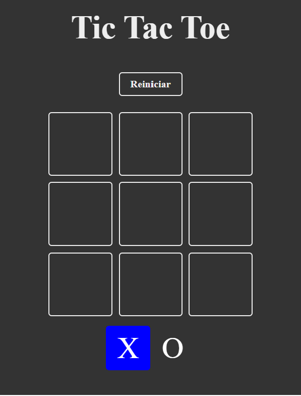
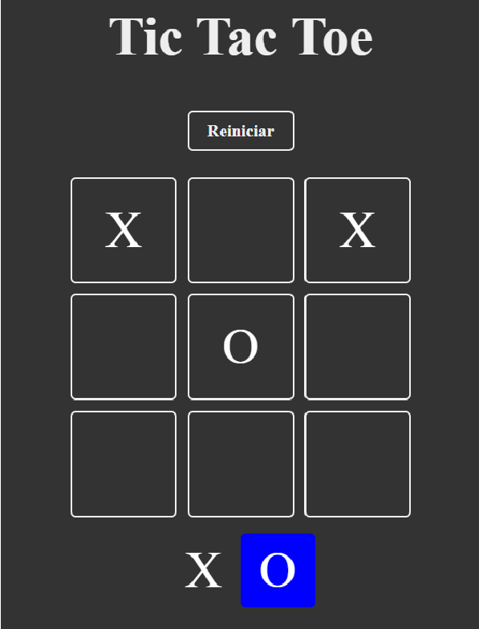
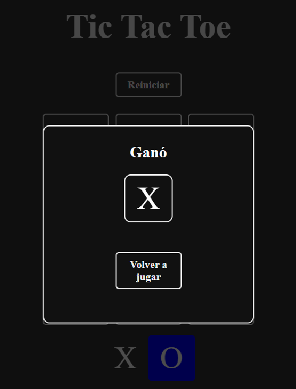

# Tic-Tac-Toe 🎮

Proyecto de practica, realizado para consolidar conocimientos sobre hacer aplicaciones usando React.

## 📦 Información del proyecto

- **Autor:** Jean Pierre Ludeña  
- **Versión:** 0.0.0  
- **Framework:** [React](https://react.dev/)  
- **Bundler:** [Vite](https://vitejs.dev/)  

## 🚀 Scripts disponibles

En el directorio del proyecto puedes ejecutar:

- `npm run dev` → Inicia el servidor de desarrollo con Vite  
- `npm run build` → Genera la versión de producción  
- `npm run preview` → Previsualiza la build de producción  
- `npm run lint` → Ejecuta ESLint para revisar el código  

## 🛠️ Instalación

1. Clona el repositorio:
   ```bash
   git clone https://github.com/tu-usuario/tic-tac-toe.git
   cd tic-tac-toe

2. Instala las dependencias:
    ```bash
    npm install

3. Inicia el servidor de desarrollo:
    ```bash
    npm run dev

## 🎯Objetivo del proyecto

Este proyecto es un juego de Tic-Tac-Toe (Tres en Raya) creado con React, pensado como práctica para afianzar conceptos de:

- Componentes y estado en React.
- Hooks (useState y useEffect).
- Creacion y uso de custom Hooks.
- Configuracion de proyectos con vite.
- Buenas practicas con ESlint.

## 📂Estructura sugerida del proyecto.


    tic-tac-toe/
    ├── public/
    ├── src/
    │   ├── components/
    │   ├── App.jsx
    │   ├── main.jsx
    ├── package.json
    └── README.md

## Imagenes del proyecto

- Pantalla inicial
 
- Jugando
 
- Ganador
